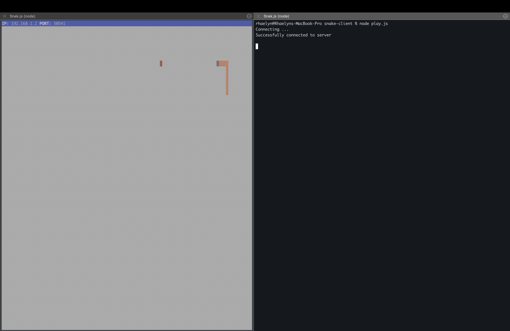

# Snake Client Project

Snake game is a very popular video game. It is a video game concept where the player maneuvers a dot and grows it by ‘eating’ pieces of food. 
As it moves and eats, it grows and the growing snake becomes an obstacle to smooth maneuvers. The goal is to grow it to become as big as possible without bumping into the side walls, or bumping into itself, upon which it dies.

This is simply a multiplayer take on the genre.

Before you can run this client, you will need to be running the server side which you can download and install from [here](https://github.com/lighthouse-labs/snek-multiplayer). 

## Final Product

## Getting Started

- Follow steps inside the snek server repo to run the server side
- Run the development snake client using the `node play.js` command.

## How to Play

- using w, a, s, d as arrow keys to move your snake along to aquire the pieces of food
- "w" is up arrow
- "a" is left arrow
- "s" is down arrow
- "d" is right arrow

if you're feeling supportive- or cheeky you can send a message out to the other players on the board

- "1" let's everyone know you're there with "Wassaaap"
- "2" Says Ouchie!
- "3" Says Nice!

And don't take too long! The Server is an fickle mistress and is quick to give you the boot if you're not fast enough